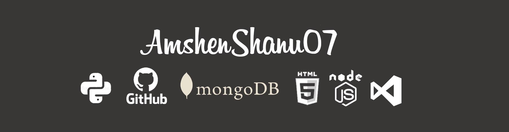

 

# About Me:
<h3>Hy world, My name is AmshenYesudas. I am from India(Kerala), I just started coding by learnning Python and i also learned WebDesigning. Now i am learning NodeJS(WebDevelopment). You can see my activity below, I also do freelance static website works</h3> 
 

## My Status:
- 🔭 I’m currently learning NodeJs 
- 🌱 I’m currently studying at +2 (12th) 
- 🤔 Don't ask me any douts i am not a Good Programmer 
- 💬 Ask me about basics of python and WebDesigning 
- ⚡ Working with some community <a href="https://t.me/httpstmejoinchatKRMA6RuflY">Hackphiles</a>  

## My Git Status
 

